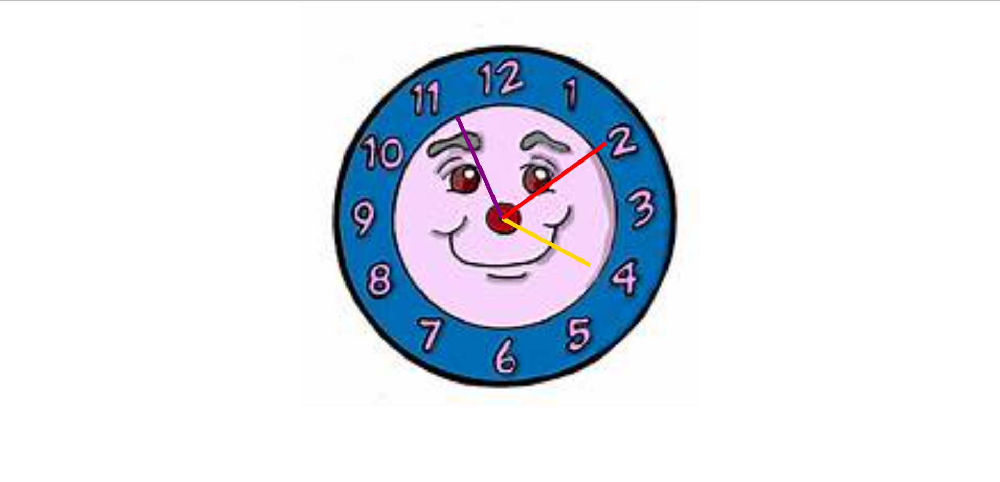

### 🕰️ Analog Wall Clock – HTML, CSS & JavaScript

*A simple and elegant analog wall clock built using HTML, CSS, and plain JavaScript.*
*The clock displays the current time with smoothly rotating hour, minute, and second hands in real time.*

**🚀 Features**
   1. 🕰️ Real-time analog clock

   2. ⏱️ Smooth second, minute, and hour hand movement

   3. ⚡ Built with pure JavaScript (no libraries)

   4. 🎨 Clean and minimal UI

   5. 🌐 Runs directly in the browser

**🛠 Tech Stack**
   - HTML

   - CSS

   - JavaScript (Vanilla JS)

**📁 Project Structure**
Clock/
│
├── clock.html
├── clock.css
├── clock.js
└── README.md

**▶️ How to Run the Project**

   1. Clone the repository - git clone https://github.com/your-username/Analog-Clock.git

   2. Open the project folder - cd analog-wall-clock

   3. Open index.html in your browser - ✅ No installation or server required.

**📸 Screenshot**

**👨‍💻 Author**
  *- Sourabh (https://github.com/Sourabh108-Coder)*
